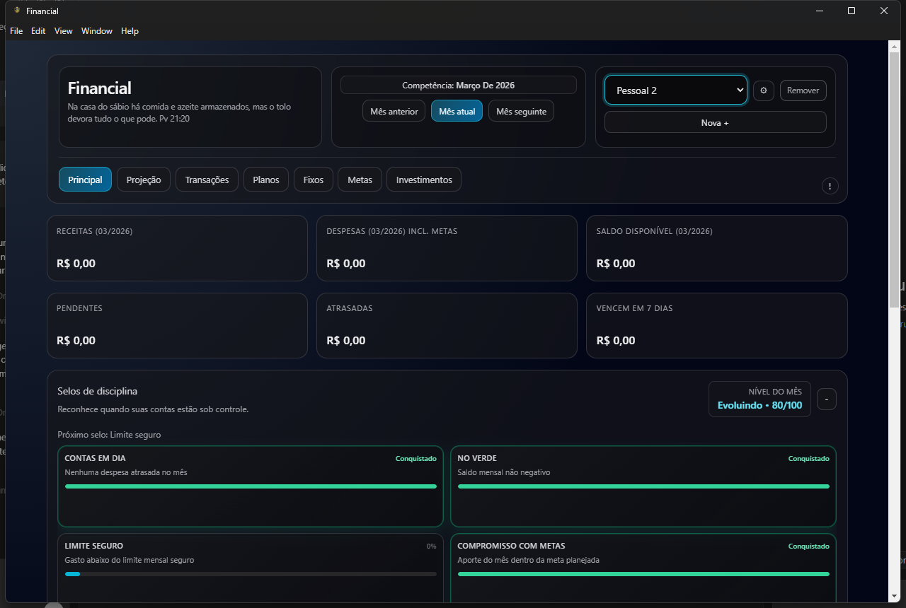

# Financial

Aplicativo desktop de finanças pessoais 100% local (offline-first), sem servidor.

## Instalação (Windows)

Baixe e instale a versão mais recente:

- **Página de releases:** https://github.com/Ukwon/Financial/releases
- **Download direto do instalador (`.exe`):** https://github.com/Ukwon/Financial/releases/download/v0.1.6/Financial.Setup.0.1.6.exe

## Demonstração visual



## Visão geral

O Financial foi criado para organizar a vida financeira mensal com foco em:

- transações reais (receitas e despesas)
- fixos mensais
- planos recorrentes e parcelados
- metas com aportes e participação por pessoa
- projeção futura com limite de gasto seguro
- simulador de investimentos
- tags para classificação de gastos
- backup e restore local

## Tecnologias

- Electron (main + preload)
- React + Vite (renderer)
- Prisma + SQLite (arquivo `.db` local)
- TailwindCSS + Recharts

## Arquitetura

- Renderer: interface React
- Preload: API segura via `window.api`
- Main: regras, IPC e persistência
- Fluxo: `React -> window.api -> IPC -> Main -> Prisma/SQLite`

## Requisitos

- Node.js 20+
- npm 10+
- Windows 10/11

## Desenvolvimento local

```bash
npm install
npm run prisma:generate
npm run dev
```

## Build de produção

```bash
npm run build
```

## Gerar instalador Windows

```bash
npm run dist:win
```

Arquivos gerados:

- `release/Financial Setup 0.1.6.exe`
- `release/win-unpacked/`

## Banco local

- Banco: SQLite
- Local do arquivo: `app.getPath("userData")/financial.db`
- Migrations: aplicadas na inicialização do app

## Backup e restore

- No app, abra **Configurações** (ícone de engrenagem).
- `Exportar`: gera um arquivo JSON com os dados.
- `Restaurar`: substitui os dados atuais pelos dados do backup selecionado.

## Scripts principais

- `npm run dev`: Vite + Electron em paralelo
- `npm run build:renderer`: build apenas do front-end
- `npm run build`: renderer + prisma generate + ícone
- `npm run dist:win`: build + instalador NSIS
- `npm run pack:win`: build + versão portátil
- `npm run test`: testes Node
- `npm run prisma:migrate`: migration em desenvolvimento
- `npm run prisma:deploy`: aplicar migrations existentes

## Estrutura resumida

- `main/`: processo principal, IPC, regras e serviços
- `renderer/`: interface React
- `prisma/`: schema e migrations
- `generated/prisma-client/`: client Prisma gerado
- `assets/`: ícones e arquivos estáticos
- `release/`: artefatos de build/instalação

## Modelo de dados (resumo)

- `Wallet`: carteiras
- `Tag`: tags por carteira
- `MonthlyTagBudget`: orçamento por tag
- `Transaction`: lançamentos reais
- `Plan`: regras de recorrência/parcelamento
- `PlanOccurrence`: ocorrências futuras
- `Goal`: metas financeiras
- `GoalAllocation`: aportes e retiradas em metas

## Licença

Licença proprietária (All Rights Reserved).

- Uso pessoal (não comercial): permitido.
- Uso comercial, revenda, redistribuição e sublicenciamento: proibidos sem autorização expressa por escrito.

Consulte o arquivo `LICENSE` para os termos completos.
